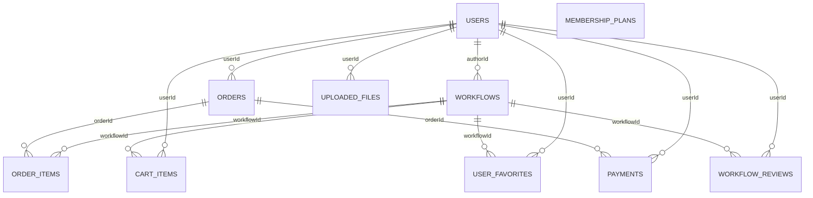

## 技术架构说明

> 版本：v1.0  
> 生成日期：根据当前会话  
> 适用工程根目录：`C:\Users\Administrator\Desktop\0\WZZ`

### 技术栈总览

- 前端
  - **框架**: React 18.3、React Router 7.8
  - **构建**: Vite 6、TypeScript 5.7、`@vitejs/plugin-react`
  - **样式/UI**: Tailwind CSS 4、`@heroui/react`、自定义插件 `plugins/vite-plugin-inject-data-locator.ts`
  - **动效/体验**: Framer Motion、虚拟列表与懒加载组件（`VirtualList`, `LazyImage`）
  - **校验/数据**: Joi、lowdb（轻量持久化/缓存）
  - **测试**: Vitest、`@testing-library/*`
  - **开发代理**: `vite.config.ts` 代理 `/api` 到后端，可按 `VITE_BACKEND_ORIGIN` 配置；`/uploads` 在 VPN 模式下直连后端

- 后端
  - **运行时/框架**: Node.js、Express 4、TypeScript
  - **数据库/ORM**: SQLite3、Knex（迁移脚本与种子数据齐全）
  - **认证与安全**: JSON Web Token、bcryptjs、helmet、cors、限流（express-rate-limit / express-slow-down）
  - **上传与静态**: Multer，静态目录 `backend/uploads`（放宽 CORP/CORS 便于跨域媒体播放）
  - **日志与监控**: Winston（`backend/logs`）、健康检查 `/health`、访问日志中间件
  - **缓存**: 内置 `node-cache`（`utils/cache.ts`），同时依赖了 ioredis（可扩展为 Redis）
  - **API 文档**: swagger-jsdoc + swagger-ui-express（挂载在 `/api`）
  - **第三方支付**: 微信/支付宝（`utils/wechat*.ts`、`utils/alipay.ts`；证书在 `backend/certs/`）
  - **工具脚本**: 迁移、媒体迁移、封面修复、工作流编码等（`backend/scripts/`）

- 工程与运维
  - **Docker**: `Dockerfile`、`docker-compose*.yml`、Nginx 配置
  - **内网穿透/调试**: `ngrok.exe`、`cloudflared.exe`、`cpolar.exe`
  - **环境配置**: `.env`/`env.local`（前后端均支持），`VITE_*` 前端变量
  - **测试**: 后端 Jest（`backend/tests`），前端 Vitest（`vitest.config.ts`）

### 运行与联调要点

- 前端开发: `npm run dev`（或 `pnpm dev`），Vite 代理 `/api` 到 `VITE_BACKEND_ORIGIN`（默认 `http://localhost:3001`）
- 后端开发: `cd backend && npm run dev`（`src/server.ts` 自动加载 `env.local`），静态媒体 `GET /uploads/*`
- 生产部署: Docker 与 Nginx（`docker/`），环境变量通过 `.env`/`env.local` 注入
- 静态媒体：前端组件如 `VideoPreviewSection`、`LazyImage` 可直接访问公开路径 `/uploads/...`
- Vite 代理要点（节选）：

```ts
// 文件：vite.config.ts（节选）
server: {
  host: true,
  watch: { ignored: ['**/backend/data/**','**/backend/uploads/**','**/*.sqlite','**/*.sqlite-shm','**/*.sqlite-wal'] },
  proxy: {
    '/api': { target: BACKEND, changeOrigin: true, secure: false, timeout: 30000, proxyTimeout: 30000 },
    ...(VPN ? {} : { '/uploads': { target: BACKEND, changeOrigin: true, secure: false, timeout: 30000, proxyTimeout: 30000 } })
  }
}
```

### 数据库模型（迁移概览）

- 核心表: `users`、`workflows`、`orders`、`order_items`、`payments`、`cart_items`
- 内容/互动: `user_favorites`、`workflow_reviews`、`uploaded_files`
- 业务增强: `membership_plans`、多项索引与字段更新（浏览/收藏计数、`isAdmin` 等）
- 位置: `backend/src/database/migrations/*`，种子数据 `seeds/001_demo_data.ts`

### 后端核心功能模块（路由与目录）

- `auth`（认证登录注册）: `backend/src/routes/auth.ts`
- `users`（用户资料/中心）: `backend/src/routes/users.ts`
- `workflows`（工作流商店/详情/检索）: `backend/src/routes/workflows.ts`
- `favorites`（收藏）: `backend/src/routes/favorites.ts`
- `reviews`（评价）: `backend/src/routes/reviews.ts`
- `cart`（购物车）: `backend/src/routes/cart.ts`
- `orders`（订单）: `backend/src/routes/orders.ts`
- `payments`（通用支付接口聚合）: `backend/src/routes/payments.ts`
- `wechat` / `wechatpay`（微信登录/支付）: `backend/src/routes/wechat*.ts`
- `alipay`（支付宝支付）: `backend/src/routes/alipay.ts`
- `uploads`（文件上传/访问）: `backend/src/routes/uploads.ts` 与静态 `GET /uploads/*`
- `recommendations`（推荐）: `backend/src/routes/recommendations.ts`
- 管理后台: `backend/src/routes/admin/*`（媒体、工作流管理）
- 中间件: 认证/管理员校验、限流、输入校验、错误处理（`backend/src/middleware/*`）
- 公共工具: 日志、缓存、支付通用逻辑（`backend/src/utils/*`）
- API 文档: `setupSwagger(app)` 挂载到 `/api`

### 前端页面与核心交互

- 用户与会员: `user/login-page.tsx`、`user/register-page.tsx`、`user/user-center-page.tsx`、`user/membership-page.tsx`、`user/recharge-page.tsx`
- 商店与内容: `workflow-store-page.tsx`、`workflow-detail-page.tsx`
- 购物/支付: `shop/cart-page.tsx`、`payment/checkout-page.tsx`、`payment/order-page.tsx`、`payment/wechat-native.tsx`、`payment/alipay-page.tsx`、`payment/alipay-result.tsx`
- 迁移工具: `migration-page.tsx`（配套组件 `migration-form.tsx`、`migration-history.tsx`）
- 首页/会员页: `home-page.tsx`、`membership-page.tsx`
- 管理后台: `admin/workflow-admin-page.tsx`
- 复用组件: `WorkflowListSection`、`WorkflowDetailHeader`、`VideoPreviewSection`、`VirtualList`、`LazyImage`、`WechatLoginModal`、`ErrorBoundary` 等

---

## 模块-API-页面对应关系表

| 模块 | 基础路径 | 关键端点（方法 路径） | 主要前端页面/组件 | 说明 |
|---|---|---|---|---|
| 版本/文档 | `/api` | GET `/` | 无（Swagger UI 嵌在 `/api`） | API 信息/文档入口 |
| 认证 Auth | `/api/auth` | POST `/register`、POST `/login`、POST `/logout`、GET `/verify`、POST `/refresh`、GET `/profile` | `user/login-page.tsx`、`user/register-page.tsx`、`WechatLoginModal` | 登录注册、Token 校验 |
| 用户 Users | `/api/users` | GET `/profile`、PUT `/profile` | `user/user-center-page.tsx` | 用户资料读取与更新 |
| 工作流 Workflows | `/api/workflows` | GET `/`、GET `/:id`、GET `/featured/recommended`、GET `/recommended/daily`、GET `/tags/popular`、GET `/categories/list`、POST `/`、PUT `/:id`、DELETE `/:id` | `workflow-store-page.tsx`、`workflow-detail-page.tsx`、`home-page.tsx` | 列表/检索/详情与增删改 |
| 收藏 Favorites | `/api/favorites` | GET `/`、POST `/:workflowId`、DELETE `/:workflowId`、GET `/check/:workflowId` | `workflow-detail-page.tsx` | 收藏、状态检查 |
| 评价 Reviews | `/api/reviews` | GET `/:workflowId`、POST `/:workflowId`、DELETE `/:workflowId`、GET `/:workflowId/my-review` | `workflow-detail-page.tsx` | 评价列表、我的评价 |
| 购物车 Cart | `/api/cart` | GET `/`、POST `/add`、PUT `/update/:id`、DELETE `/remove/:id`、DELETE `/clear` | `shop/cart-page.tsx` | 购物车增删改查 |
| 订单 Orders | `/api/orders` | GET `/`、GET `/:id`、POST `/`、PUT `/:id/cancel`、PUT `/:id/confirm`、GET `/purchased/workflows` | `payment/checkout-page.tsx`、`payment/order-page.tsx` | 下单、订单生命周期 |
| 支付（聚合）Payments | `/api/payments` | POST `/`、GET `/:id/status`、GET `/history` | `payment/checkout-page.tsx`、`payment/order-page.tsx` | 占位/聚合查询 |
| 微信支付 WeChatPay | `/api/pay/wechat` | POST `/native`、POST `/h5`、POST `/jsapi`、GET `/query/:outTradeNo`、POST `/close`、POST `/callback`、POST `/sync` | `payment/wechat-native.tsx`、`payment/checkout-page.tsx`、`payment/order-page.tsx` | 微信下单/回调/查询 |
| 支付宝 Alipay | `/api/pay/alipay` | POST `/create`、GET `/query/:outTradeNo`、POST `/refund`、POST `/close`、POST `/notify`、GET `/return`、POST `/sync` | `payment/alipay-page.tsx`、`payment/alipay-result.tsx`、`payment/order-page.tsx` | 支付宝下单/回调/查询 |
| 上传 Uploads | `/api/uploads` | POST `/single`、POST `/multiple`、GET `/list`、DELETE `/:id` | `migration-page.tsx`、`migration-form.tsx`、`VideoPreviewSection`、`LazyImage` | 用户文件管理；静态访问 `GET /uploads/*` |
| 个性化推荐 | `/api/recommendations` | GET `/personalized`、GET `/similar/:workflowId`、GET `/trending` | `home-page.tsx`、`workflow-detail-page.tsx` | 个性化/相似/热门 |
| 管理后台 | `/api/admin` | GET `/` | `admin/workflow-admin-page.tsx` | 管理端根 |
| 管理-工作流 | `/api/admin/workflows` | GET `/`、GET `/:id`、POST `/`、POST `/:id/duplicate`、PUT `/:id`、DELETE `/:id` | `admin/workflow-admin-page.tsx` | 管理工作流增删改查/复制 |
| 管理-媒体 | `/api/admin/media` | POST `/video/preview`、POST `/video/demo`、POST `/image/cover`、POST `/image/gallery`、POST `/file/attachment` | `admin/workflow-admin-page.tsx` | 管理端媒体上传 |
| 微信登录 | `/api/wechat` | POST `/qrcode`、GET `/status/:scene`、GET `/callback`、POST `/callback` | `WechatLoginModal`、`user/login-page.tsx` | PC 扫码登录/事件回调 |

---

## 详细端点清单（按模块）

- Auth `/api/auth`
  - POST `/register`、POST `/login`、POST `/logout`、GET `/verify`、POST `/refresh`、GET `/profile`
- Users `/api/users`
  - GET `/profile`、PUT `/profile`
- Workflows `/api/workflows`
  - GET `/`、GET `/:id`、GET `/featured/recommended`、GET `/recommended/daily`、GET `/tags/popular`、GET `/categories/list`、POST `/`、PUT `/:id`、DELETE `/:id`
- Favorites `/api/favorites`
  - GET `/`、POST `/:workflowId`、DELETE `/:workflowId`、GET `/check/:workflowId`
- Reviews `/api/reviews`
  - GET `/:workflowId`、POST `/:workflowId`、DELETE `/:workflowId`、GET `/:workflowId/my-review`
- Cart `/api/cart`
  - GET `/`、POST `/add`、PUT `/update/:id`、DELETE `/remove/:id`、DELETE `/clear`
- Orders `/api/orders`
  - GET `/`、GET `/:id`、POST `/`、PUT `/:id/cancel`、PUT `/:id/confirm`、GET `/purchased/workflows`
- Payments `/api/payments`
  - POST `/`、GET `/:id/status`、GET `/history`
- WeChatPay `/api/pay/wechat`
  - POST `/native`、POST `/h5`、POST `/jsapi`、GET `/query/:outTradeNo`、POST `/close`、POST `/callback`、POST `/sync`
- Alipay `/api/pay/alipay`
  - POST `/create`、GET `/query/:outTradeNo`、POST `/refund`、POST `/close`、POST `/notify`、GET `/return`、POST `/sync`
- Uploads `/api/uploads`
  - POST `/single`、POST `/multiple`、GET `/list`、DELETE `/:id`
- Recommendations `/api/recommendations`
  - GET `/personalized`、GET `/similar/:workflowId`、GET `/trending`
- Admin `/api/admin`
  - GET `/`
  - Workflows：GET `/`、GET `/:id`、POST `/`、POST `/:id/duplicate`、PUT `/:id`、DELETE `/:id`
  - Media：POST `/video/preview`、POST `/video/demo`、POST `/image/cover`、POST `/image/gallery`、POST `/file/attachment`
- WeChat Login `/api/wechat`
  - POST `/qrcode`、GET `/status/:scene`、GET `/callback`、POST `/callback`

---

## 页面 → 函数 → 接口 → 字段映射（按页面/组件）

- 说明：受保护接口需携带 `Authorization: Bearer {token}`；统一响应 `ApiResponse`：`{ success, data?, message?, error?, code? }`

### 认证与用户

| 页面/组件 | 前端函数 | 方法 路径 | 请求 | 关键返回字段 data |
|---|---|---|---|---|
| user/login-page.tsx | `authApi.login` | POST `/api/auth/login` | { email, password } | user:{ id, username, email, avatar, isVip, balance, vipExpiresAt }, token |
| user/register-page.tsx | `authApi.register` | POST `/api/auth/register` | { username, email, password, avatar? } | 同上 |
| WechatLoginModal | `authApi.createWechatLoginQrcode` | POST `/api/wechat/qrcode` | - | { scene, imageUrl, expireSeconds } |
| WechatLoginModal | `authApi.getWechatLoginStatus` | GET `/api/wechat/status/:scene` | - | { status, token?, user? } |
| user/user-center-page.tsx | `userApi.getProfile` | GET `/api/users/profile` | - | { id, username, email, avatar, isVip, balance, vipExpiresAt, createdAt } |
| user/user-center-page.tsx | `userApi.updateProfile` | PUT `/api/users/profile` | { username?, avatar? } | message |

### 工作流浏览与详情

| 页面/组件 | 前端函数 | 方法 路径 | 请求 | 关键返回字段 data |
|---|---|---|---|---|
| workflow-store-page.tsx | `workflowApi.getWorkflows` | GET `/api/workflows?query` | page,limit,search,category,tags,priceRange,isVip,isFree,isHot,isNew,authorId,sortBy,sortOrder | { items:[...], pagination:{ page,limit,total,totalPages,hasNext,hasPrev } } |
| workflow-detail-page.tsx | `workflowApi.getWorkflow` | GET `/api/workflows/:id` | - | workflow 明细（JSON字段已解析）；`content` 仅作者/管理员/已购/VIP可见 |
| home-page.tsx | `workflowApi.getRecommended` | GET `/api/workflows/featured/recommended?limit` | limit | workflow[]（JSON字段已解析） |
| home-page.tsx | `workflowApi.getDailyRecommended` | GET `/api/workflows/recommended/daily?limit` | `limit<=3` | 同上 |
| 任意 | `workflowApi.getPopularTags` | GET `/api/workflows/tags/popular` | - | [{ tag, count }] |

### 收藏与评价

| 页面/组件 | 前端函数 | 方法 路径 | 请求 | 关键返回字段 data |
|---|---|---|---|---|
| workflow-detail-page.tsx | `favoriteApi.getFavorites` | GET `/api/favorites?page&limit` | page,limit | { favorites:[workflow...], pagination } |
| workflow-detail-page.tsx | `favoriteApi.addFavorite` | POST `/api/favorites/:workflowId` | - | message |
| workflow-detail-page.tsx | `favoriteApi.removeFavorite` | DELETE `/api/favorites/:workflowId` | - | message |
| workflow-detail-page.tsx | `favoriteApi.checkFavorite` | GET `/api/favorites/check/:workflowId` | - | { isFavorited, favoriteDate } |
| workflow-detail-page.tsx | `reviewApi.getReviews` | GET `/api/reviews/:workflowId?query` | page,limit,sortBy,sortOrder | { reviews:[...], pagination, statistics:{ totalReviews, averageRating, ratingDistribution } } |
| workflow-detail-page.tsx | `reviewApi.createOrUpdateReview` | POST `/api/reviews/:workflowId` | { rating, comment? } | message |
| workflow-detail-page.tsx | `reviewApi.deleteReview` | DELETE `/api/reviews/:workflowId` | - | message |
| workflow-detail-page.tsx | `reviewApi.getMyReview` | GET `/api/reviews/:workflowId/my-review` | - | review|null |

### 购物/下单/支付

| 页面/组件 | 前端函数 | 方法 路径 | 请求 | 关键返回字段 data |
|---|---|---|---|---|
| shop/cart-page.tsx | `cartApi.getCart` | GET `/api/cart` | - | { items:[...], totalAmount, totalItems } |
| shop/cart-page.tsx | `cartApi.addToCart` | POST `/api/cart/add` | { workflowId, quantity } | message |
| shop/cart-page.tsx | `cartApi.updateCartItem` | PUT `/api/cart/update/:id` | { quantity } | message |
| shop/cart-page.tsx | `cartApi.removeFromCart` | DELETE `/api/cart/remove/:id` | - | message |
| shop/cart-page.tsx | `cartApi.clearCart` | DELETE `/api/cart/clear` | - | message |
| payment/checkout-page.tsx | `orderApi.createOrder` | POST `/api/orders` | { items:[{ workflowId,quantity }], shippingAddress?, paymentMethod? } | { orderId, totalAmount, status } |
| payment/order-page.tsx | `orderApi.getOrders` | GET `/api/orders?query` | page,limit,status | { orders:[{ ...order, items:[...] }], pagination } |
| payment/order-page.tsx | `orderApi.getOrder` | GET `/api/orders/:id` | - | { ...order, items:[{ ..., content /* 原始值 */ }] } |
| payment/order-page.tsx | `orderApi.cancelOrder` | PUT `/api/orders/:id/cancel` | - | message |
| payment/order-page.tsx | `orderApi.confirmOrder` | PUT `/api/orders/:id/confirm` | - | message |
| payment/alipay-page.tsx | `paymentApi.createAlipay` | POST `/api/pay/alipay/create` | { orderId, type } | { paymentId, payUrl? , qrCode? } |
| payment/wechat-native.tsx | `paymentApi.createWechatNative` | POST `/api/pay/wechat/native` | { orderId } | { paymentId, codeUrl } |
| payment/order-page.tsx | `paymentApi.getPaymentStatus` | GET `/api/payments/:id/status` | - | { id, status, method } |
| payment/order-page.tsx | `paymentApi.getPaymentHistory` | GET `/api/payments/history?page&limit` | page,limit | { payments, pagination } |

### 上传/迁移与管理

| 页面/组件 | 前端函数 | 方法 路径 | 请求 | 关键返回字段 data |
|---|---|---|---|---|
| migration-page.tsx, `VideoPreviewSection`, `LazyImage` | `uploadApi.uploadSingle` | POST `/api/uploads/single` | multipart: file | { id, url } |
| migration-page.tsx | `uploadApi.uploadMultiple` | POST `/api/uploads/multiple` | multipart: files[] | [{ id, url }] |
| migration-page.tsx | `uploadApi.getFiles` | GET `/api/uploads/list?page&limit` | page,limit | { files, pagination } |
| migration-page.tsx | `uploadApi.deleteFile` | DELETE `/api/uploads/:id` | - | message |
| admin/workflow-admin-page.tsx | `workflowApi.createWorkflow` | POST `/api/workflows` | 工作流字段 | { id, code, title, price } |
| admin/workflow-admin-page.tsx | `workflowApi.updateWorkflow` | PUT `/api/workflows/:id` | 工作流字段 | message |
| admin/workflow-admin-page.tsx | `workflowApi.deleteWorkflow` | DELETE `/api/workflows/:id` | - | message |

---

## 数据库实体字段与关系（ER - Mermaid）



- `users`
  - id PK, username, email UNIQUE, passwordHash, avatar, isVip, vipExpiresAt, balance, isAdmin, createdAt, updatedAt
  - 索引: email, username, isAdmin, `(isVip, vipExpiresAt)`, `createdAt`
- `workflows`
  - id PK, title, description, author, authorId FK→users.id, authorAvatar, price, isVip, isFree, cover, tags(JSON), workflowCount, downloadCount, rating, ratingCount, content(JSON), category, subcategory, status(enum: draft/published/archived/featured), sortOrder, previewVideo, demoVideo, gallery(JSON), shortDescription, features(JSON), requirements, changelog(JSON), version, compatibility(JSON), dependencies(JSON), seoTitle, seoDescription, seoKeywords(JSON), isHot, isNew, originalPrice, publishedAt, viewCount, favoriteCount, createdAt, updatedAt
  - 索引: authorId, price, isVip, isFree, createdAt, 多列复合索引见 DDL
- `orders`
  - id PK, userId FK→users.id, status(enum: pending/processing/shipping/completed/cancelled/refunded/paid), totalAmount, shippingAddress, trackingNumber, paymentMethod, paymentId, createdAt, updatedAt
  - 索引: userId, status, createdAt, 复合 `(userId,status,createdAt)`、`(status,updatedAt)`
- `order_items`
  - id PK, orderId FK→orders.id, workflowId FK→workflows.id, workflowTitle, price, quantity, createdAt
  - 索引: orderId, workflowId, `(workflowId, createdAt)`
- `payments`
  - id PK, orderId FK→orders.id, userId FK→users.id, amount, method(enum: alipay/wechat/balance), status(enum: pending/processing/success/failed/cancelled), transactionId, failureReason, createdAt, updatedAt
  - 索引: orderId, userId, status, `(userId,status)`、`(orderId,status)`
- `cart_items`
  - id PK, userId FK→users.id, workflowId FK→workflows.id, quantity, createdAt
  - 约束: UNIQUE(userId, workflowId)
  - 索引: userId, workflowId, `(userId, createdAt)`
- `user_favorites`
  - id PK, userId FK→users.id, workflowId FK→workflows.id, createdAt
  - 约束: UNIQUE(userId, workflowId)
  - 索引: userId, workflowId, `(userId, workflowId)`
- `workflow_reviews`
  - id PK, userId FK→users.id, workflowId FK→workflows.id, rating(1-5), comment, createdAt, updatedAt
  - 索引: userId, workflowId, rating, createdAt
- `uploaded_files`
  - id PK, originalName, filename, mimetype, size, path, url, userId FK→users.id, createdAt
  - 索引: userId, filename, createdAt
- `membership_plans`
  - id PK, name, description, price, duration(days), features(JSON), isActive, createdAt, updatedAt
  - 索引: isActive, price

---

## SQL DDL（SQLite，合并迁移后的结构）

```sql
-- users
CREATE TABLE users (
  id TEXT PRIMARY KEY,
  username TEXT NOT NULL,
  email TEXT NOT NULL UNIQUE,
  passwordHash TEXT NOT NULL,
  avatar TEXT,
  isVip INTEGER DEFAULT 0,
  vipExpiresAt DATETIME,
  balance DECIMAL(10,2) DEFAULT 0,
  isAdmin INTEGER NOT NULL DEFAULT 0,
  createdAt DATETIME DEFAULT CURRENT_TIMESTAMP,
  updatedAt DATETIME DEFAULT CURRENT_TIMESTAMP
);
CREATE INDEX idx_users_email ON users(email);
CREATE INDEX idx_users_username ON users(username);
CREATE INDEX idx_users_vip_expires ON users(isVip, vipExpiresAt);
CREATE INDEX idx_users_created ON users(createdAt);

-- workflows
CREATE TABLE workflows (
  id TEXT PRIMARY KEY,
  title TEXT NOT NULL,
  description TEXT,
  author TEXT NOT NULL,
  authorId TEXT REFERENCES users(id) ON DELETE CASCADE,
  authorAvatar TEXT,
  price DECIMAL(10,2) DEFAULT 0,
  originalPrice DECIMAL(10,2),
  isVip INTEGER DEFAULT 0,
  isFree INTEGER DEFAULT 0,
  cover TEXT,
  tags TEXT,
  workflowCount INTEGER DEFAULT 1,
  downloadCount INTEGER DEFAULT 0,
  rating REAL DEFAULT 0,
  ratingCount INTEGER DEFAULT 0,
  content TEXT,
  previewVideo TEXT,
  demoVideo TEXT,
  gallery TEXT,
  shortDescription TEXT,
  features TEXT,
  requirements TEXT,
  changelog TEXT,
  category TEXT DEFAULT 'general',
  subcategory TEXT,
  status TEXT DEFAULT 'draft',
  sortOrder INTEGER DEFAULT 0,
  version TEXT DEFAULT '1.0.0',
  compatibility TEXT,
  dependencies TEXT,
  seoTitle TEXT,
  seoDescription TEXT,
  seoKeywords TEXT,
  isHot INTEGER DEFAULT 0,
  isNew INTEGER DEFAULT 0,
  publishedAt DATETIME,
  viewCount INTEGER NOT NULL DEFAULT 0,
  favoriteCount INTEGER NOT NULL DEFAULT 0,
  createdAt DATETIME DEFAULT CURRENT_TIMESTAMP,
  updatedAt DATETIME DEFAULT CURRENT_TIMESTAMP
);
CREATE INDEX idx_workflows_authorId ON workflows(authorId);
CREATE INDEX idx_workflows_price ON workflows(price);
CREATE INDEX idx_workflows_isVip ON workflows(isVip);
CREATE INDEX idx_workflows_isFree ON workflows(isFree);
CREATE INDEX idx_workflows_createdAt ON workflows(createdAt);
CREATE INDEX idx_workflows_status_created ON workflows(status, createdAt);
CREATE INDEX idx_workflows_category_price ON workflows(category, price);
CREATE INDEX idx_workflows_vip_free_rating ON workflows(isVip, isFree, rating);
CREATE INDEX idx_workflows_author_status ON workflows(authorId, status);
CREATE INDEX idx_workflows_title ON workflows(title);
CREATE INDEX idx_workflows_tags ON workflows(tags);
CREATE INDEX workflows_status_index ON workflows(status);
CREATE INDEX workflows_category_index ON workflows(category);
CREATE INDEX workflows_subcategory_index ON workflows(subcategory);
CREATE INDEX workflows_authorid_index ON workflows(authorId);
CREATE INDEX workflows_sortorder_index ON workflows(sortOrder);
CREATE INDEX workflows_createdat_index ON workflows(createdAt);
CREATE INDEX workflows_updatedat_index ON workflows(updatedAt);
CREATE INDEX workflows_publishedat_index ON workflows(publishedAt);

-- orders
CREATE TABLE orders (
  id TEXT PRIMARY KEY,
  userId TEXT REFERENCES users(id) ON DELETE CASCADE,
  status TEXT DEFAULT 'pending',
  totalAmount DECIMAL(10,2) NOT NULL,
  shippingAddress TEXT,
  trackingNumber TEXT,
  paymentMethod TEXT,
  paymentId TEXT,
  createdAt DATETIME DEFAULT CURRENT_TIMESTAMP,
  updatedAt DATETIME DEFAULT CURRENT_TIMESTAMP,
  CHECK (status IN ('pending','processing','shipping','completed','cancelled','refunded','paid'))
);
CREATE INDEX idx_orders_user ON orders(userId);
CREATE INDEX idx_orders_status ON orders(status);
CREATE INDEX idx_orders_createdAt ON orders(createdAt);
CREATE INDEX idx_orders_user_status_created ON orders(userId, status, createdAt);
CREATE INDEX idx_orders_status_updated ON orders(status, updatedAt);

-- order_items
CREATE TABLE order_items (
  id TEXT PRIMARY KEY,
  orderId TEXT REFERENCES orders(id) ON DELETE CASCADE,
  workflowId TEXT REFERENCES workflows(id) ON DELETE CASCADE,
  workflowTitle TEXT NOT NULL,
  price DECIMAL(10,2) NOT NULL,
  quantity INTEGER DEFAULT 1,
  createdAt DATETIME DEFAULT CURRENT_TIMESTAMP
);
CREATE INDEX idx_order_items_orderId ON order_items(orderId);
CREATE INDEX idx_order_items_workflowId ON order_items(workflowId);
CREATE INDEX idx_order_items_workflow_created ON order_items(workflowId, createdAt);

-- payments
CREATE TABLE payments (
  id TEXT PRIMARY KEY,
  orderId TEXT REFERENCES orders(id) ON DELETE CASCADE,
  userId TEXT REFERENCES users(id) ON DELETE CASCADE,
  amount DECIMAL(10,2) NOT NULL,
  method TEXT NOT NULL,
  status TEXT DEFAULT 'pending',
  transactionId TEXT,
  failureReason TEXT,
  createdAt DATETIME DEFAULT CURRENT_TIMESTAMP,
  updatedAt DATETIME DEFAULT CURRENT_TIMESTAMP,
  CHECK (method IN ('alipay','wechat','balance')),
  CHECK (status IN ('pending','processing','success','failed','cancelled'))
);
CREATE INDEX idx_payments_orderId ON payments(orderId);
CREATE INDEX idx_payments_userId ON payments(userId);
CREATE INDEX idx_payments_status ON payments(status);
CREATE INDEX idx_payments_user_status ON payments(userId, status);
CREATE INDEX idx_payments_order_status ON payments(orderId, status);

-- cart_items
CREATE TABLE cart_items (
  id TEXT PRIMARY KEY,
  userId TEXT REFERENCES users(id) ON DELETE CASCADE,
  workflowId TEXT REFERENCES workflows(id) ON DELETE CASCADE,
  quantity INTEGER DEFAULT 1,
  createdAt DATETIME DEFAULT CURRENT_TIMESTAMP,
  UNIQUE (userId, workflowId)
);
CREATE INDEX idx_cart_items_user ON cart_items(userId);
CREATE INDEX idx_cart_items_workflow ON cart_items(workflowId);
CREATE INDEX idx_cart_items_user_created ON cart_items(userId, createdAt);

-- user_favorites
CREATE TABLE user_favorites (
  id TEXT PRIMARY KEY,
  userId TEXT REFERENCES users(id) ON DELETE CASCADE,
  workflowId TEXT REFERENCES workflows(id) ON DELETE CASCADE,
  createdAt DATETIME DEFAULT CURRENT_TIMESTAMP,
  UNIQUE (userId, workflowId)
);
CREATE INDEX idx_user_fav_user ON user_favorites(userId);
CREATE INDEX idx_user_fav_workflow ON user_favorites(workflowId);
CREATE INDEX idx_user_fav_user_workflow ON user_favorites(userId, workflowId);

-- workflow_reviews
CREATE TABLE workflow_reviews (
  id TEXT PRIMARY KEY,
  userId TEXT REFERENCES users(id) ON DELETE CASCADE,
  workflowId TEXT REFERENCES workflows(id) ON DELETE CASCADE,
  rating INTEGER NOT NULL,
  comment TEXT,
  createdAt DATETIME DEFAULT CURRENT_TIMESTAMP,
  updatedAt DATETIME DEFAULT CURRENT_TIMESTAMP,
  UNIQUE (userId, workflowId),
  CHECK (rating >= 1 AND rating <= 5)
);
CREATE INDEX idx_reviews_user ON workflow_reviews(userId);
CREATE INDEX idx_reviews_workflow ON workflow_reviews(workflowId);
CREATE INDEX idx_reviews_rating ON workflow_reviews(rating);
CREATE INDEX idx_reviews_createdAt ON workflow_reviews(createdAt);

-- uploaded_files
CREATE TABLE uploaded_files (
  id TEXT PRIMARY KEY,
  originalName TEXT NOT NULL,
  filename TEXT NOT NULL,
  mimetype TEXT NOT NULL,
  size INTEGER NOT NULL,
  path TEXT NOT NULL,
  url TEXT NOT NULL,
  userId TEXT REFERENCES users(id) ON DELETE CASCADE,
  createdAt DATETIME DEFAULT CURRENT_TIMESTAMP
);
CREATE INDEX uploaded_files_userid_index ON uploaded_files(userId);
CREATE INDEX uploaded_files_createdat_index ON uploaded_files(createdAt);
CREATE INDEX idx_uploaded_files_filename ON uploaded_files(filename);

-- membership_plans
CREATE TABLE membership_plans (
  id TEXT PRIMARY KEY,
  name TEXT NOT NULL,
  description TEXT,
  price DECIMAL(10,2) NOT NULL,
  duration INTEGER NOT NULL,
  features TEXT,
  isActive INTEGER DEFAULT 1,
  createdAt DATETIME DEFAULT CURRENT_TIMESTAMP,
  updatedAt DATETIME DEFAULT CURRENT_TIMESTAMP
);
CREATE INDEX idx_membership_active ON membership_plans(isActive);
CREATE INDEX idx_membership_price ON membership_plans(price);
```

---

## OpenAPI 3.0 草案（核心端点）

```yaml
openapi: 3.0.3
info:
  title: WZ 工作流商城 API
  version: 1.0.0
servers:
  - url: /api
components:
  securitySchemes:
    bearerAuth:
      type: http
      scheme: bearer
      bearerFormat: JWT
  schemas:
    ApiResponse:
      type: object
      properties:
        success: { type: boolean }
        message: { type: string }
        error: { type: string }
        code: { type: string }
        data: { nullable: true }
    Pagination:
      type: object
      properties:
        page: { type: integer }
        limit: { type: integer }
        total: { type: integer }
        totalPages: { type: integer }
        hasNext: { type: boolean }
        hasPrev: { type: boolean }
    User:
      type: object
      properties:
        id: { type: string }
        username: { type: string }
        email: { type: string, format: email }
        avatar: { type: string, nullable: true }
        isVip: { type: boolean }
        vipExpiresAt: { type: string, format: date-time, nullable: true }
        balance: { type: number, format: float }
        isAdmin: { type: boolean }
        createdAt: { type: string, format: date-time }
        updatedAt: { type: string, format: date-time }
    Workflow:
      type: object
      properties:
        id: { type: string }
        title: { type: string }
        description: { type: string, nullable: true }
        author: { type: string }
        authorId: { type: string }
        authorAvatar: { type: string, nullable: true }
        price: { type: number }
        originalPrice: { type: number, nullable: true }
        isVip: { type: boolean }
        isFree: { type: boolean }
        cover: { type: string, nullable: true }
        previewVideo: { type: string, nullable: true }
        demoVideo: { type: string, nullable: true }
        tags: { type: array, items: { type: string } }
        gallery: { type: array, items: { type: string } }
        features: { type: array, items: { type: string } }
        compatibility: { type: object, additionalProperties: true }
        dependencies: { type: array, items: { type: string } }
        seoKeywords: { type: array, items: { type: string } }
        shortDescription: { type: string, nullable: true }
        requirements: { type: string, nullable: true }
        changelog: { type: array, items: { type: object } }
        category: { type: string }
        subcategory: { type: string, nullable: true }
        status: { type: string, enum: [draft,published,archived,featured] }
        sortOrder: { type: integer }
        rating: { type: number }
        ratingCount: { type: integer }
        downloadCount: { type: integer }
        viewCount: { type: integer }
        favoriteCount: { type: integer }
        version: { type: string }
        publishedAt: { type: string, format: date-time, nullable: true }
        createdAt: { type: string, format: date-time }
        updatedAt: { type: string, format: date-time }
        content:
          nullable: true
    Order:
      type: object
      properties:
        id: { type: string }
        userId: { type: string }
        status: { type: string, enum: [pending,processing,shipping,completed,cancelled,refunded,paid] }
        totalAmount: { type: number }
        shippingAddress: { type: string, nullable: true }
        trackingNumber: { type: string, nullable: true }
        paymentMethod: { type: string, nullable: true }
        paymentId: { type: string, nullable: true }
        createdAt: { type: string, format: date-time }
        updatedAt: { type: string, format: date-time }
    OrderItem:
      type: object
      properties:
        id: { type: string }
        orderId: { type: string }
        workflowId: { type: string }
        workflowTitle: { type: string }
        price: { type: number }
        quantity: { type: integer }
        createdAt: { type: string, format: date-time }
    Payment:
      type: object
      properties:
        id: { type: string }
        orderId: { type: string }
        userId: { type: string }
        amount: { type: number }
        method: { type: string, enum: [alipay,wechat,balance] }
        status: { type: string, enum: [pending,processing,success,failed,cancelled] }
        transactionId: { type: string, nullable: true }
        failureReason: { type: string, nullable: true }
        createdAt: { type: string, format: date-time }
        updatedAt: { type: string, format: date-time }
    CartItem:
      type: object
      properties:
        id: { type: string }
        userId: { type: string }
        workflowId: { type: string }
        quantity: { type: integer }
        createdAt: { type: string, format: date-time }
    UploadedFile:
      type: object
      properties:
        id: { type: string }
        originalName: { type: string }
        filename: { type: string }
        mimetype: { type: string }
        size: { type: integer }
        path: { type: string }
        url: { type: string }
        userId: { type: string }
        createdAt: { type: string, format: date-time }
    Review:
      type: object
      properties:
        id: { type: string }
        userId: { type: string }
        workflowId: { type: string }
        rating: { type: integer, minimum: 1, maximum: 5 }
        comment: { type: string, nullable: true }
        createdAt: { type: string, format: date-time }
        updatedAt: { type: string, format: date-time }
paths:
  /auth/login:
    post:
      summary: 用户登录
      requestBody:
        required: true
        content:
          application/json:
            schema: { type: object, properties: { email: {type: string}, password: {type: string} }, required: [email,password] }
      responses:
        "200": { description: OK, content: { application/json: { schema: { $ref: '#/components/schemas/ApiResponse' } } } }
  /auth/register:
    post:
      summary: 用户注册
      requestBody:
        required: true
        content:
          application/json:
            schema: { type: object, properties: { username:{type:string},email:{type:string},password:{type:string},avatar:{type:string} }, required: [username,email,password] }
      responses:
        "201": { description: Created, content: { application/json: { schema: { $ref: '#/components/schemas/ApiResponse' } } } }
  /users/profile:
    get:
      security: [ { bearerAuth: [] } ]
      responses: { "200": { content: { application/json: { schema: { $ref: '#/components/schemas/ApiResponse' } } } } }
    put:
      security: [ { bearerAuth: [] } ]
      requestBody:
        required: true
        content: { application/json: { schema: { type: object, properties: { username:{type:string}, avatar:{type:string} } } } }
      responses: { "200": { content: { application/json: { schema: { $ref: '#/components/schemas/ApiResponse' } } } } }
  /workflows:
    get:
      summary: 工作流列表（分页/筛选）
      parameters:
        - in: query; name: page; schema: { type: integer }
        - in: query; name: limit; schema: { type: integer }
        - in: query; name: search; schema: { type: string }
        - in: query; name: category; schema: { type: string }
        - in: query; name: tags; schema: { type: string }
        - in: query; name: priceRange; schema: { type: string }
        - in: query; name: isVip; schema: { type: boolean }
        - in: query; name: isFree; schema: { type: boolean }
        - in: query; name: isHot; schema: { type: boolean }
        - in: query; name: isNew; schema: { type: boolean }
        - in: query; name: authorId; schema: { type: string }
        - in: query; name: sortBy; schema: { type: string }
        - in: query; name: sortOrder; schema: { type: string, enum: [asc,desc] }
      responses: { "200": { content: { application/json: { schema: { $ref: '#/components/schemas/ApiResponse' } } } } }
    post:
      summary: 创建工作流
      security: [ { bearerAuth: [] } ]
      requestBody: { required: true, content: { application/json: { schema: { type: object } } } }
      responses: { "201": { content: { application/json: { schema: { $ref: '#/components/schemas/ApiResponse' } } } } }
  /workflows/{id}:
    get:
      summary: 工作流详情（按权限返回 content）
      parameters: [ { in: path, name: id, required: true, schema: { type: string } } ]
      responses: { "200": { content: { application/json: { schema: { $ref: '#/components/schemas/ApiResponse' } } } } }
    put:
      security: [ { bearerAuth: [] } ]
      requestBody: { required: true, content: { application/json: { schema: { type: object } } } }
      responses: { "200": { content: { application/json: { schema: { $ref: '#/components/schemas/ApiResponse' } } } } }
    delete:
      security: [ { bearerAuth: [] } ]
      responses: { "200": { content: { application/json: { schema: { $ref: '#/components/schemas/ApiResponse' } } } } }
  /favorites:
    get:
      security: [ { bearerAuth: [] } ]
      parameters: [ { in: query, name: page, schema: {type: integer}}, { in: query, name: limit, schema: {type: integer}} ]
      responses: { "200": { content: { application/json: { schema: { $ref: '#/components/schemas/ApiResponse' } } } } }
  /favorites/{workflowId}:
    post:
      security: [ { bearerAuth: [] } ]
      parameters: [ { in: path, name: workflowId, required: true, schema: { type: string } } ]
      responses: { "200": { content: { application/json: { schema: { $ref: '#/components/schemas/ApiResponse' } } } } }
    delete:
      security: [ { bearerAuth: [] } ]
      parameters: [ { in: path, name: workflowId, required: true, schema: { type: string } } ]
      responses: { "200": { content: { application/json: { schema: { $ref: '#/components/schemas/ApiResponse' } } } } }
  /favorites/check/{workflowId}:
    get:
      security: [ { bearerAuth: [] } ]
      parameters: [ { in: path, name: workflowId, required: true, schema: { type: string } } ]
      responses: { "200": { content: { application/json: { schema: { $ref: '#/components/schemas/ApiResponse' } } } } }
  /reviews/{workflowId}:
    get:
      parameters:
        - { in: path, name: workflowId, required: true, schema: { type: string } }
        - { in: query, name: page, schema: { type: integer } }
        - { in: query, name: limit, schema: { type: integer } }
        - { in: query, name: sortBy, schema: { type: string } }
        - { in: query, name: sortOrder, schema: { type: string, enum: [asc,desc] } }
      responses: { "200": { content: { application/json: { schema: { $ref: '#/components/schemas/ApiResponse' } } } } }
    post:
      security: [ { bearerAuth: [] } ]
      requestBody: { required: true, content: { application/json: { schema: { type: object, properties: { rating:{type:integer,minimum:1,maximum:5}, comment:{type:string} }, required:[rating] } } } }
      responses: { "200": { content: { application/json: { schema: { $ref: '#/components/schemas/ApiResponse' } } } } }
    delete:
      security: [ { bearerAuth: [] } ]
      responses: { "200": { content: { application/json: { schema: { $ref: '#/components/schemas/ApiResponse' } } } } }
  /reviews/{workflowId}/my-review:
    get:
      security: [ { bearerAuth: [] } ]
      responses: { "200": { content: { application/json: { schema: { $ref: '#/components/schemas/ApiResponse' } } } } }
  /cart:
    get:
      security: [ { bearerAuth: [] } ]
      responses: { "200": { content: { application/json: { schema: { $ref: '#/components/schemas/ApiResponse' } } } } }
  /cart/add:
    post:
      security: [ { bearerAuth: [] } ]
      requestBody: { required: true, content: { application/json: { schema: { type: object, properties: { workflowId:{type:string}, quantity:{type:integer,default:1} }, required:[workflowId] } } } }
      responses: { "200": { content: { application/json: { schema: { $ref: '#/components/schemas/ApiResponse' } } } } }
  /cart/update/{id}:
    put:
      security: [ { bearerAuth: [] } ]
      parameters: [ { in: path, name: id, required: true, schema: { type: string } } ]
      requestBody: { required: true, content: { application/json: { schema: { type: object, properties: { quantity:{type:integer,minimum:1} }, required:[quantity] } } } }
      responses: { "200": { content: { application/json: { schema: { $ref: '#/components/schemas/ApiResponse' } } } } }
  /cart/remove/{id}:
    delete:
      security: [ { bearerAuth: [] } ]
      parameters: [ { in: path, name: id, required: true, schema: { type: string } } ]
      responses: { "200": { content: { application/json: { schema: { $ref: '#/components/schemas/ApiResponse' } } } } }
  /cart/clear:
    delete:
      security: [ { bearerAuth: [] } ]
      responses: { "200": { content: { application/json: { schema: { $ref: '#/components/schemas/ApiResponse' } } } } }
  /orders:
    get:
      security: [ { bearerAuth: [] } ]
      parameters: [ { in: query, name: page, schema: {type:integer}}, { in: query, name: limit, schema: {type:integer}}, { in: query, name: status, schema: {type:string}} ]
      responses: { "200": { content: { application/json: { schema: { $ref: '#/components/schemas/ApiResponse' } } } } }
    post:
      security: [ { bearerAuth: [] } ]
      requestBody:
        required: true
        content:
          application/json:
            schema:
              type: object
              properties:
                items:
                  type: array
                  items: { type: object, properties: { workflowId:{type:string}, quantity:{type:integer,default:1} }, required:[workflowId] }
                shippingAddress: { type: string }
                paymentMethod: { type: string, enum: [balance,wechat,alipay] }
              required: [items]
      responses:
        "201": { content: { application/json: { schema: { $ref: '#/components/schemas/ApiResponse' } } } }
  /orders/{id}:
    get:
      security: [ { bearerAuth: [] } ]
      parameters: [ { in: path, name: id, required: true, schema: { type: string } } ]
      responses: { "200": { content: { application/json: { schema: { $ref: '#/components/schemas/ApiResponse' } } } } }
  /orders/{id}/cancel:
    put:
      security: [ { bearerAuth: [] } ]
      responses: { "200": { content: { application/json: { schema: { $ref: '#/components/schemas/ApiResponse' } } } } }
  /orders/{id}/confirm:
    put:
      security: [ { bearerAuth: [] } ]
      responses: { "200": { content: { application/json: { schema: { $ref: '#/components/schemas/ApiResponse' } } } } }
  /payments:
    post:
      security: [ { bearerAuth: [] } ]
      requestBody: { required: true, content: { application/json: { schema: { type: object, properties: { orderId:{type:string}, method:{type:string,enum:[alipay,wechat,balance]}, returnUrl:{type:string} }, required:[orderId,method] } } } }
      responses: { "201": { content: { application/json: { schema: { $ref: '#/components/schemas/ApiResponse' } } } } }
  /payments/{id}/status:
    get:
      security: [ { bearerAuth: [] } ]
      parameters: [ { in: path, name: id, required: true, schema: { type: string } } ]
      responses: { "200": { content: { application/json: { schema: { $ref: '#/components/schemas/ApiResponse' } } } } }
  /payments/history:
    get:
      security: [ { bearerAuth: [] } ]
      parameters: [ { in: query, name: page, schema: {type:integer}}, { in: query, name: limit, schema: {type:integer}} ]
      responses: { "200": { content: { application/json: { schema: { $ref: '#/components/schemas/ApiResponse' } } } } }
  /pay/wechat/native:
    post:
      security: [ { bearerAuth: [] } ]
      requestBody: { required: true, content: { application/json: { schema: { type: object, properties: { orderId:{type:string} }, required:[orderId] } } } }
      responses: { "200": { content: { application/json: { schema: { $ref: '#/components/schemas/ApiResponse' } } } } }
  /pay/alipay/create:
    post:
      security: [ { bearerAuth: [] } ]
      requestBody: { required: true, content: { application/json: { schema: { type: object, properties: { orderId:{type:string}, type:{type:string,enum:[page,wap,qr]} }, required:[orderId] } } } }
      responses: { "200": { content: { application/json: { schema: { $ref: '#/components/schemas/ApiResponse' } } } } }
  /uploads/single:
    post:
      security: [ { bearerAuth: [] } ]
      requestBody:
        required: true
        content:
          multipart/form-data:
            schema:
              type: object
              properties: { file: { type: string, format: binary } }
              required: [file]
      responses: { "201": { content: { application/json: { schema: { $ref: '#/components/schemas/ApiResponse' } } } } }
  /uploads/multiple:
    post:
      security: [ { bearerAuth: [] } ]
      requestBody:
        required: true
        content:
          multipart/form-data:
            schema:
              type: object
              properties: { files: { type: array, items: { type: string, format: binary } } }
              required: [files]
      responses: { "201": { content: { application/json: { schema: { $ref: '#/components/schemas/ApiResponse' } } } } }
  /uploads/list:
    get:
      security: [ { bearerAuth: [] } ]
      parameters: [ { in: query, name: page, schema: {type:integer}}, { in: query, name: limit, schema: {type:integer}} ]
      responses: { "200": { content: { application/json: { schema: { $ref: '#/components/schemas/ApiResponse' } } } } }
  /uploads/{id}:
    delete:
      security: [ { bearerAuth: [] } ]
      parameters: [ { in: path, name: id, required: true, schema: { type: string } } ]
      responses: { "200": { content: { application/json: { schema: { $ref: '#/components/schemas/ApiResponse' } } } } }
```

---

## 常用 cURL 示例

```bash
# 登录
curl -X POST http://localhost:3001/api/auth/login \
  -H "Content-Type: application/json" \
  -d '{"email":"test@example.com","password":"pass"}'

# 获取个人资料
curl http://localhost:3001/api/users/profile \
  -H "Authorization: Bearer YOUR_TOKEN"

# 工作流列表（搜索+分页）
curl "http://localhost:3001/api/workflows?search=ai&limit=12&page=1"

# 工作流详情
curl http://localhost:3001/api/workflows/WORKFLOW_ID

# 添加收藏
curl -X POST http://localhost:3001/api/favorites/WORKFLOW_ID \
  -H "Authorization: Bearer YOUR_TOKEN"

# 提交评价
curl -X POST http://localhost:3001/api/reviews/WORKFLOW_ID \
  -H "Authorization: Bearer YOUR_TOKEN" -H "Content-Type: application/json" \
  -d '{"rating":5,"comment":"很棒"}'

# 购物车添加
curl -X POST http://localhost:3001/api/cart/add \
  -H "Authorization: Bearer YOUR_TOKEN" -H "Content-Type: application/json" \
  -d '{"workflowId":"WORKFLOW_ID","quantity":1}'

# 创建订单
curl -X POST http://localhost:3001/api/orders \
  -H "Authorization: Bearer YOUR_TOKEN" -H "Content-Type: application/json" \
  -d '{"items":[{"workflowId":"WORKFLOW_ID","quantity":1}],"paymentMethod":"wechat"}'

# 发起微信 Native 支付（二维码 URL）
curl -X POST http://localhost:3001/api/pay/wechat/native \
  -H "Authorization: Bearer YOUR_TOKEN" -H "Content-Type: application/json" \
  -d '{"orderId":"ORDER_ID"}'

# 发起支付宝 page 支付（返回支付跳转URL）
curl -X POST http://localhost:3001/api/pay/alipay/create \
  -H "Authorization: Bearer YOUR_TOKEN" -H "Content-Type: application/json" \
  -d '{"orderId":"ORDER_ID","type":"page"}'

# 上传单文件
curl -X POST http://localhost:3001/api/uploads/single \
  -H "Authorization: Bearer YOUR_TOKEN" \
  -F "file=@/path/to/file.png"
```

---

## 备注

- 前端 `VITE_VPN_MODE=true` 时，`/uploads` 不走代理，直接按后端真实地址访问，减少大文件代理中断风险。
- 后端 `server.ts` 对静态媒体响应头设置了 `Cross-Origin-Resource-Policy: cross-origin` 与 `Access-Control-Allow-Origin: *`，便于跨源 `<canvas>` 绘制与视频播放。
- 健康检查端点：`GET /health`，返回连接状态、缓存统计、内存信息等；可用于探活与监控。


